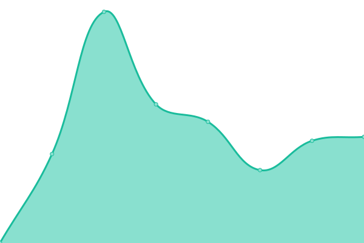
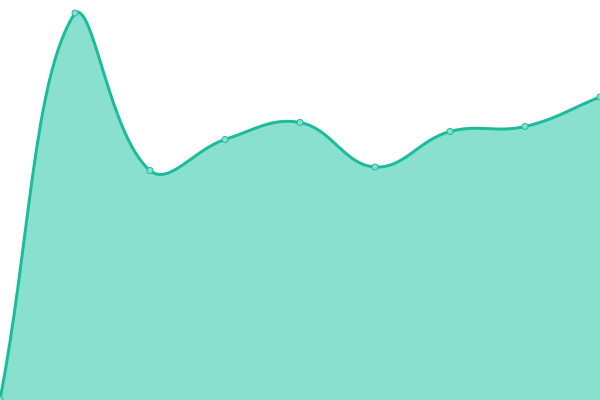

# 

<!--start: status pages-->
<!-- This summary is generated by Upptime (https://github.com/upptime/upptime) -->
<!-- Do not edit this manually, your changes will be overwritten -->
<!-- prettier-ignore -->
| URL | Status | History | Response Time | Uptime |
| --- | ------ | ------- | ------------- | ------ |
|  [Yago Page](https://yago.cloud) | 🟩 Up | [yago-page.yml](https://github.com/bitforge/yago_status_page/commits/HEAD/history/yago-page.yml) | 

 828ms
     
 | 

<a href="https://status.yago.cloud/history/yago-page">100.00%</a>
    

|  [Yago App](https://app.yago.cloud) | 🟩 Up | [yago-app.yml](https://github.com/bitforge/yago_status_page/commits/HEAD/history/yago-app.yml) | 

 253ms
     
 | 

<a href="https://status.yago.cloud/history/yago-app">100.00%</a>
    

|  [Yago API](https://yago.cloud/api/health) | 🟩 Up | [yago-api.yml](https://github.com/bitforge/yago_status_page/commits/HEAD/history/yago-api.yml) | 

 619ms
     
 | 

<a href="https://status.yago.cloud/history/yago-api">100.00%</a>
    

<!--end: status pages-->
